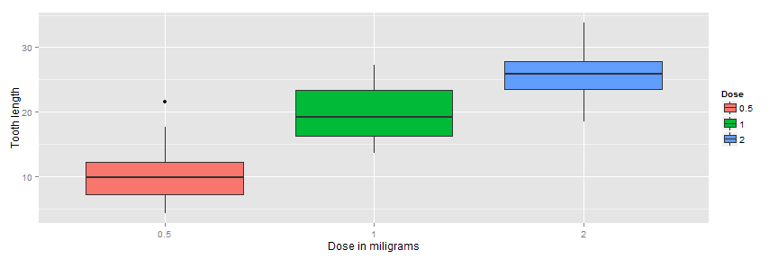

  
## Synopsis:
We're going to analyze the ToothGrowth data in the R datasets package.  
Provide a basic summary of the data. Use confidence intervals and/or hypothesis tests to compare tooth growth by supp and dose. (Only use the techniques from class, even if there's other approaches worth considering). State your conclusions and the assumptions needed for your conclusions. 


##1.Load the ToothGrowth data and perform some basic exploratory data analyses

```r
library(datasets)
data(ToothGrowth)
#preview the dataset
head(ToothGrowth)
```

```
##    len supp dose
## 1  4.2   VC  0.5
## 2 11.5   VC  0.5
## 3  7.3   VC  0.5
## 4  5.8   VC  0.5
## 5  6.4   VC  0.5
## 6 10.0   VC  0.5
```

```r
# exploring the data
nrow(ToothGrowth)
```

```
## [1] 60
```

```r
str(ToothGrowth)
```

```
## 'data.frame':	60 obs. of  3 variables:
##  $ len : num  4.2 11.5 7.3 5.8 6.4 10 11.2 11.2 5.2 7 ...
##  $ supp: Factor w/ 2 levels "OJ","VC": 2 2 2 2 2 2 2 2 2 2 ...
##  $ dose: num  0.5 0.5 0.5 0.5 0.5 0.5 0.5 0.5 0.5 0.5 ...
```

```r
# convert dose field from numeric to factor
ToothGrowth$dose <- as.factor(ToothGrowth$dose)

# view data set again
str(ToothGrowth)
```

```
## 'data.frame':	60 obs. of  3 variables:
##  $ len : num  4.2 11.5 7.3 5.8 6.4 10 11.2 11.2 5.2 7 ...
##  $ supp: Factor w/ 2 levels "OJ","VC": 2 2 2 2 2 2 2 2 2 2 ...
##  $ dose: Factor w/ 3 levels "0.5","1","2": 1 1 1 1 1 1 1 1 1 1 ...
```

```r
#let's plot it out and visualise the data
library(ggplot2)

ggplot(aes(x=dose, y=len), data=ToothGrowth) + geom_boxplot(aes(fill=dose)) + xlab("Dose in miligrams") + ylab("Tooth length") + guides(fill=guide_legend(title="Dose"))
```

 

#2. Provide a basic summary of the data.

```r
summary(ToothGrowth)
```

```
##       len        supp     dose   
##  Min.   : 4.20   OJ:30   0.5:20  
##  1st Qu.:13.07   VC:30   1  :20  
##  Median :19.25           2  :20  
##  Mean   :18.81                   
##  3rd Qu.:25.27                   
##  Max.   :33.90
```

#3. Use confidence intervals and/or hypothesis tests to compare tooth growth by supp and dose. 

```r
t.test(len ~ supp, data = ToothGrowth)
```

```
## 
## 	Welch Two Sample t-test
## 
## data:  len by supp
## t = 1.9153, df = 55.309, p-value = 0.06063
## alternative hypothesis: true difference in means is not equal to 0
## 95 percent confidence interval:
##  -0.1710156  7.5710156
## sample estimates:
## mean in group OJ mean in group VC 
##         20.66333         16.96333
```

```r
#a. Compare by Supplement

t1 <- t.test(len~supp, paired=F, var.equal=F, data=ToothGrowth)
t1.summary <- data.frame("p-value"=c(t1$p.value),"CI-Lower"=c(t1$conf[1]), "CI-Upper"=c(t1$conf[2]), 
     row.names=c("OJ vs. VC:  "))
round(t1.summary,4)
```

```
##              p.value CI.Lower CI.Upper
## OJ vs. VC:    0.0606   -0.171    7.571
```

```r
#b. Compare by Dosage
df05 <- subset(ToothGrowth, ToothGrowth$dose==.5)
df10 <- subset(ToothGrowth, ToothGrowth$dose==1)
df20 <- subset(ToothGrowth, ToothGrowth$dose==2)

t0510<- t.test(df05$len, df10$len, paired=F, var.equal=F)
t0520<- t.test(df05$len, df20$len, paired=F, var.equal=F)
t1020<- t.test(df10$len, df20$len, paired=F, var.equal=F)

summaryDose <- data.frame("p-value"=c(t0510$p.value,t0520$p.value,t1020$p.value), 
     "CI-Lower"=c(t0510$conf[1],t0520$conf[1],t1020$conf[1]),
     "CI-Upper"=c(t0510$conf[2],t0520$conf[2],t1020$conf[2]),
     row.names=c(".5mg vs 1mg: ", ".5mg vs 2mg: ","1mg vs 2mg: "))

round(summaryDose, 6)
```

```
##               p.value   CI.Lower   CI.Upper
## .5mg vs 1mg:  0.0e+00 -11.983781  -6.276219
## .5mg vs 2mg:  0.0e+00 -18.156167 -12.833833
## 1mg vs 2mg:   1.9e-05  -8.996481  -3.733519
```

```r
#c. Compare Supplement within each dosage group

t05 <- t.test(len~supp, paired=F, var.equal=F, data=df05)
t10 <- t.test(len~supp, paired=F, var.equal=F, data=df10)
t20 <- t.test(len~supp, paired=F, var.equal=F, data=df20)

summarySuppDose <- data.frame("p-value"=c(t05$p.value,t10$p.value,t20$p.value), 
     "CI-Lower"=c(t05$conf[1],t10$conf[1],t20$conf[1]),
     "CI-Upper"=c(t05$conf[2],t10$conf[2],t20$conf[2]),
     row.names=c(".5mg OJ vs. VC: ", "1mg OJ vs. VC: ","2mg OJ vs. VC: "))

round(summarySuppDose, 6)
```

```
##                   p.value  CI.Lower CI.Upper
## .5mg OJ vs. VC:  0.006359  1.719057 8.780943
## 1mg OJ vs. VC:   0.001038  2.802148 9.057852
## 2mg OJ vs. VC:   0.963852 -3.798070 3.638070
```

#4. Conclusions

Assumed variance is not the same and test population is small, hence t-test is used.

With low doses such as (0.5 and 1), the orange juice causes more growth than the ascorbic acid.
With the high dose (2), there's no significant difference in the supplement. 

It is apparent that higher dosages had a significant effect on toothgrowth. In all cases, p-values were incredible small and no confidence interval contained zero in 3rd test

